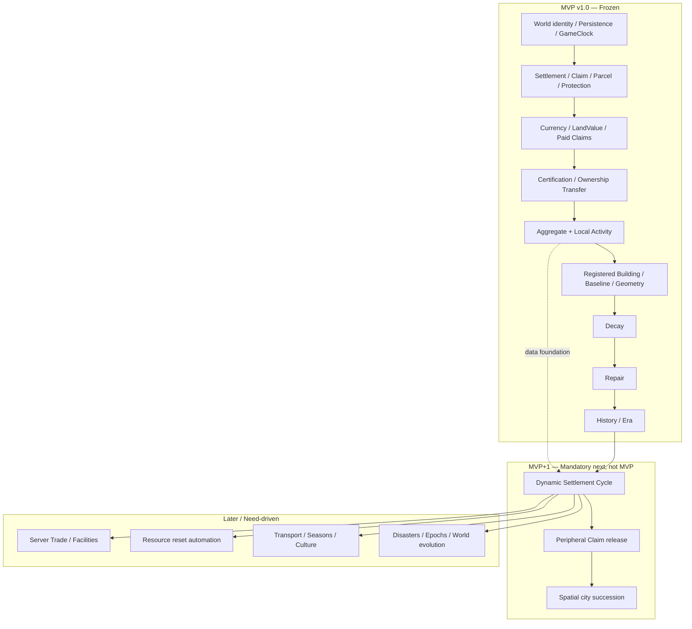
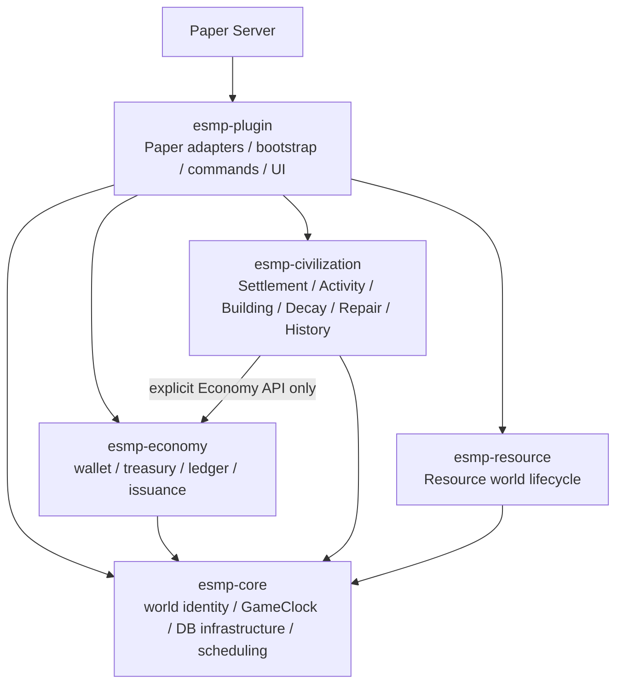
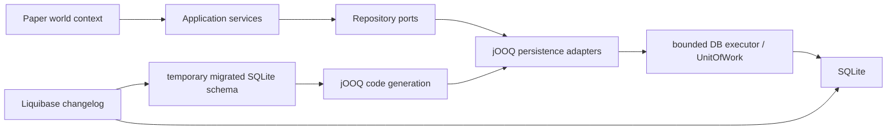

# ESMP Architecture Diagrams

These diagrams correspond to the frozen MVP architecture.

## MVP boundary

```mermaid
flowchart TB
    subgraph MVP["MVP v1.0 — Frozen"]
      A["World identity / Persistence / GameClock"]
      B["Settlement / Claim / Parcel / Protection"]
      C["Currency / LandValue / Paid Claims"]
      D["Certification / Ownership Transfer"]
      E["Aggregate + Local Activity"]
      F["Registered Building / Baseline / Geometry"]
      G["Decay"]
      H["Repair"]
      I["History / Era"]
      A --> B --> C --> D --> E --> F --> G --> H --> I
    end

    subgraph NEXT["MVP+1 — Mandatory next, not MVP"]
      J["Dynamic Settlement Cycle"]
      K["Peripheral Claim release"]
      L["Spatial city succession"]
      J --> K --> L
    end

    subgraph LATER["Later / Need-driven"]
      M["Server Trade / Facilities"]
      N["Resource reset automation"]
      O["Transport / Seasons / Culture"]
      P["Disasters / Epochs / World evolution"]
    end

    E -. "data foundation" .-> J
    I --> J
    J --> M
    J --> N
    J --> O
    J --> P
```

## Module dependencies

```mermaid
flowchart TB
    P["Paper Server"]
    PL["esmp-plugin\nPaper adapters / bootstrap / commands / UI"]
    C["esmp-core\nworld identity / GameClock / DB infrastructure / scheduling"]
    E["esmp-economy\nwallet / treasury / ledger / issuance"]
    V["esmp-civilization\nSettlement / Activity / Building / Decay / Repair / History"]
    R["esmp-resource\nResource world lifecycle"]

    P --> PL
    PL --> C
    PL --> E
    PL --> V
    PL --> R
    E --> C
    V --> C
    R --> C
    V -->|"explicit Economy API only"| E
```

## Persistence boundary

```mermaid
flowchart LR
    W["Paper world context"]
    APP["Application services"]
    REPO["Repository ports"]
    J["jOOQ persistence adapters"]
    DBX["bounded DB executor / UnitOfWork"]
    S["SQLite"]
    L["Liquibase changelog"]
    CG["temporary migrated SQLite schema"]
    GEN["jOOQ code generation"]

    W --> APP
    APP --> REPO
    REPO --> J
    J --> DBX
    DBX --> S

    L --> S
    L --> CG
    CG --> GEN
    GEN --> J
```
